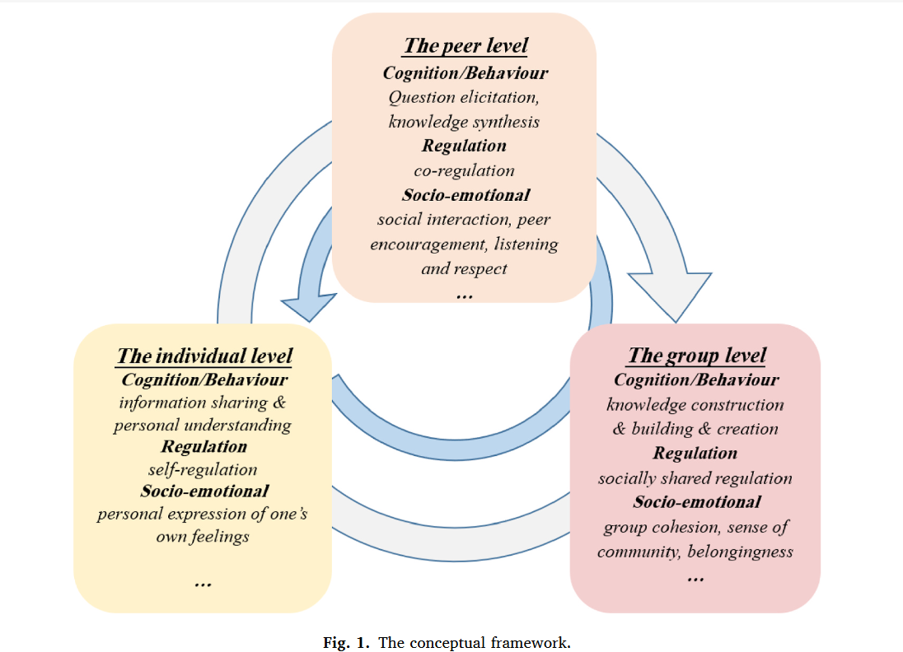

# 追踪并促进多视角下的知识建构--在线协作学习平台的设计与实现

​	目前许多研究都认为从多视角分析学生的知识建构情况很重要。一般认为从个人视角、同伴视角以及团队视角可以看到较为完整的知识建构过程。个人视角下是指学生个体在知识建构的过程中分享了多少观点，思考的深度有多少。同伴视角是指学生在知识建构的过程中与同伴进行了多少次的互动，包括同意了多少同伴的观点，不同意多少同伴的观点。小组视角是指学生基于小组讨论的结果达成了多少共识，总结了多少知识和观点。

